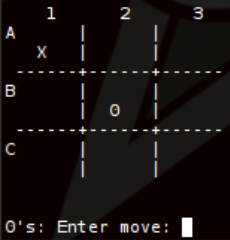

# Oblig 2
---
I denne innlevering skal du implementere Tic Tac Toe.




Minimumkravet er 

Du trenger blant annet disse bibliotekene

```python 
    import os
    import time
    import numpy as np
```

---
**os brukes til å tømme terminalen**

```python 
def clear():
    os.system('cls' if os.name == 'nt' else 'clear')    
```
---
**time kan du bruke til å sette en pause før datamaskinen flytter**
```python 
time.sleep(1)
```


**numpy kan du bruke til array og arrayoperasjoner.**
```python 
np.zeros(shape=(3,3))*np.nan
```

**og trekke tilfeldige heltall**
```python 
np.random.randint(0,3)
```
