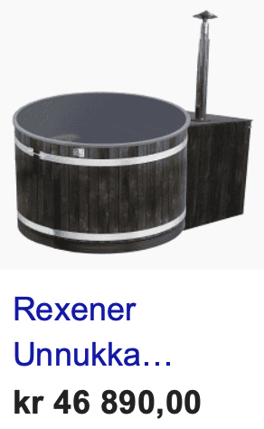

## Test deg selv 1

## 1.1

---

Skriv et program som skriver "5 ganger 10 er 50" til konsoll ved å bruke variabler for tallene 5, 10 og 50.

## 2.2

---

Skriv et program som bruker variablene under (erstatt variabelnavnene med mer passende navn) til å skrive forslag til e-post adresser til konsoll.

Kriterier:

- Epostadressene skal bestå av fornavn og etternavn, separert med punktum, etterfulgt av @ og et valgfritt domene, for eksempel "test.testesen@bedrift.no".

- Epostadressene som skrives ut skal være uten mellomrom.

- Variabelen som inneholder "domene" skal ikke inneholde "@".

- Epostadressen skal lagres i en egen variabel, og denne nye variabelen skal printes ut

```Python
fornavn = "Et fornavn her"

etternavn = "Et etternavn her"

domene = "Et domene her"
```

## 2.3 Rentes rente

---

**Python**

Nora setter inn 34 000 kr på konto med fast rente til 3,4 % per år. Hun lar pengene stå urørt. Hvor mye har hun på kontoen etter 10 år.

## 2.4 Halvering

---

**CAS**

Et firma produserer 10 tonn plastavfall i året. De bestemmer seg for å redusere avfallsmengden med 10 % per år. Hvor lang tid tar det før avfallsmengden er halvert.

---

<br>

**Utfordringer**

## 3.1 Spareavtale

---

Jon Arild har starte en spareavtale i banken sin. Avtalen går ut på at han skal sette inn 1000 kr i måneden de neste 10 årene med en avtalefestet avkastning på 0.1 % i måneden.

Hvor mye står det på kontoen til Jon Aril om 10 år?

```Python
#saldo = 0
#innskudd = ....
#rente = ....
#vekstfaktor = ....
#ant_mnd = .....

for mnd in range(ant_mnd):
    #saldo etter innskudd
    #saldo etter renteinntekt
    #Skriv ut saldoen

#Skriv ut endelig saldo der du svarer på spørsmålet over
```

## 3.2 Brøk

---


## 

<br>

## 4.1 Frivillig (vanskelig)

---



John steinar har kjøpt seg en jacuzzi til 46 890,00 kr på avbetaling de neste 10 årene.

- Avdrag i starten av hvert år: 2028,42 kr.
- Årlig rente: 15 %
- Periode: 10 år.

Hva blir totalprisen på jacuzzien til John Steinar?
