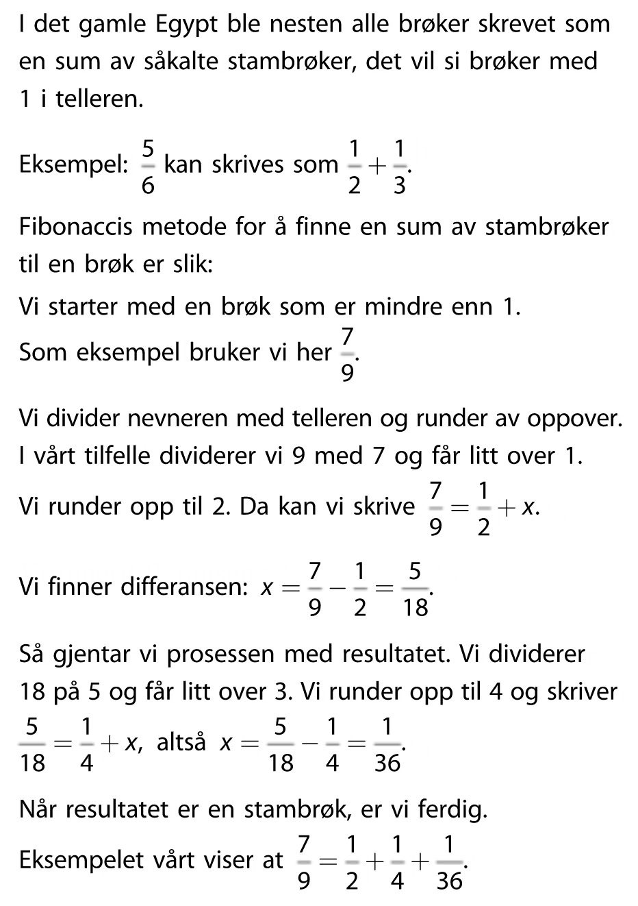
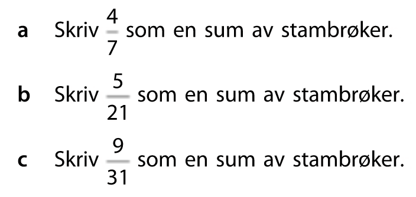

## Test deg selv 1

## 1.1

---

Skriv et program som skriver "5 ganger 10 er 50" til konsoll ved å bruke variabler for tallene 5 og 10 og produktet.

## 2.2

---

Skriv et program som bruker variablene under (erstatt variabelnavnene med mer passende navn) til å skrive forslag til e-post adresser til konsoll.

Kriterier:

- Epostadressen skal bestå av fornavn og etternavn, separert med punktum, etterfulgt av @ og et valgfritt domene, for eksempel "test.testesen@bedrift.no".

- Epostadressen som skrives ut skal være uten mellomrom.

- Variabelen som inneholder "domene" skal ikke inneholde "@".

- Epostadressen skal lagres i en egen variabel, og denne nye variabelen skal printes ut

```Python
fornavn = "Et fornavn her"

etternavn = "Et etternavn her"

domene = "Et domene her"
```

## 2.3 Rentes rente

---

**Python**

Nora setter inn 34 000 kr på konto med fast rente til 3,4 % per år. Hun lar pengene stå urørt. Hvor mye har hun på kontoen etter 10 år. Skriv ut svaret med to desimaler.

Flott hvis du gjør det både med formel og med en for-løkke.

## 2.4 Halvering

---

**GeoGebra**

Et firma produserer 10 tonn plastavfall i året. De bestemmer seg for å redusere avfallsmengden med 10 % per år. Hvor lang tid tar det før avfallsmengden er halvert.

---

<br>

**Utfordringer**

## 3.1 Stambrøk

---





<br>
<br>

## 3.2 Fibonacci

---


Fibonacci (ca. 1170–ca. 1250) var ein italiensk matematikar frå Pisa i Nord-Italia. Han er mest kjend for talfølgen som er oppkallt etter han, Fibonacci-tallene.
<br><br>
Fibonacci-tallene er tallfølgen <br>
1, 1, 2, 3, 5, 8, 13, 21, 34, ...
<br><br>

<ol type="a">
    <li>Skriv opp de neste tre tallene i Fibonacci-følgen.<br><br>
    <li>Lag et program i Python som skriver ut de første 100 tallene i Fibonacci-følgen.</li>
</ol>
<br>

## 3.3 Spareavtale

---

Jon Arild har starte en spareavtale i banken sin. Avtalen går ut på at han skal sette inn 1000 kr i måneden de neste 10 årene med en avtalefestet avkastning på 0.1 % i måneden.

Hvor mye står det på kontoen til Jon Aril om 10 år? Skriv ut svaret med to desimaler.

```Python
# saldo = 0
# innskudd = ....
# rente = ....
# vekstfaktor = ....
# ant_mnd = .....

for mnd in range(ant_mnd):
    # saldo etter innskudd
    # saldo etter renteinntekt
    # skriv ut saldoen

# Skriv ut endelig saldo der du svarer på spørsmålet over
```
