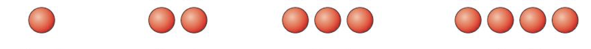
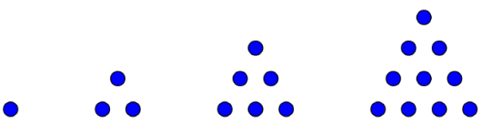
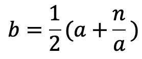
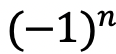
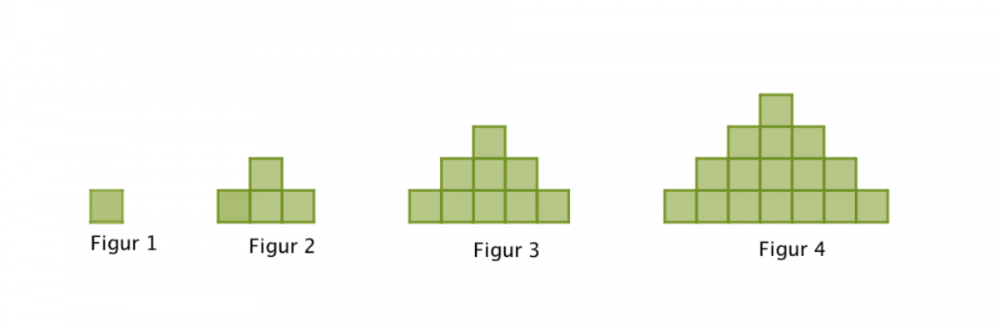
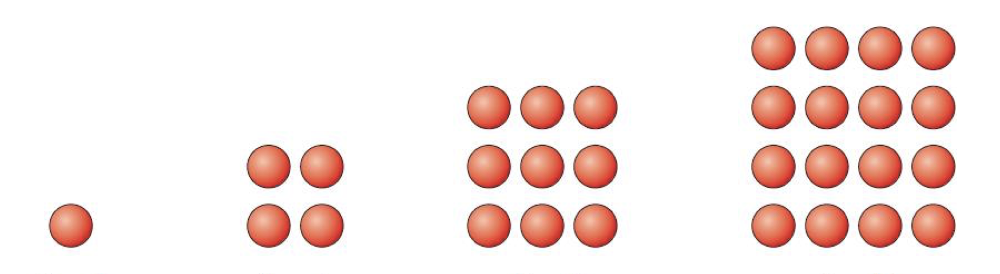
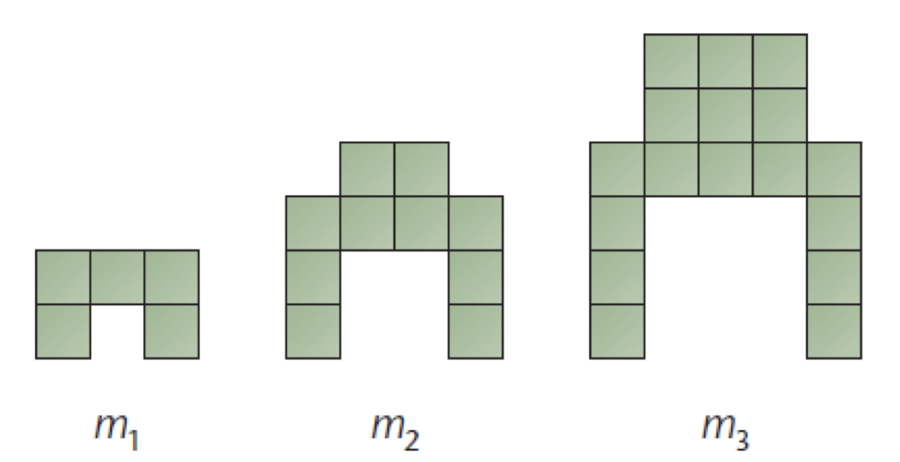

## Test deg selv 2

## 1.1

---

Forklar programmene nedenfor

**a.**

```Python
for n in range(50):
    partall = 2*n
    print(partall)
```

**b.**

```Python
for n in range(50):
    oddetall = 2*n + 1
    print(oddetall)
```

**c.**

```Python
for n in range(0, 101, 2):
    print(n)
```

**d.**

```Python
for n in range(1, 100, 2):
    print(n)
```

**e.**

```Python
for n in range(1, 100):
    if n%2 == 0:
        print(n)
```

**f.**

```Python
for n in range(1, 100):
    if n%2 != 0:
        print(n)
```

## 1.2

---

Forklar programmene nedenfor

```Python
sum = 0

for n in range(6):
    partall = 2*n
    sum = sum + partall

print(sum)
```

**b.**

```Python
sum = 0

for n in range(5):
    oddetall = 2*n + 1
    sum = sum + oddetall

print(sum)
```

## 2.1

---

**a.** Lag et program som skriver ut partallene mellom 1000 og 12000

**b.** Lag et program som skriver ut oddetallene mellom 500 og 750

<br>

## 2.2 Figurtall

---



**a.** Skriv opp de 5 første tallene

**b.** Lag et program som skriver ut de 10 første tallene.

<br>

## 2.3 Trekanttallene

---



**a.** Skriv opp de 5 første tallene

**b.** Lag et program som skriver ut de 10 første tallene.

**c.** Bestem summen av de 10 første trekanttallene.

<br>

## 3.1 Kvadratrottilnærming

---


Heron fra Alexandria er en kjent matematiker fra antikken. Han laget blant annet en algoritme for å finne tilnærmingsverdier for kvadratroten av et naturlig tall, n:

- Velg et tall, a, i nærheten av det du tror svaret blir
- Regn ut tallet

    

- Gjenta punkt 2 til du får et tall som er så nøyaktig som du ønsker. b blir den nye a-en.

**a.** Sett a = 1 og n = 4, og utfør algoritmen 3 ganger for hånd.

**b.** Bruk en for-løkke til å utføre algorithmen i Python for tallene 483.

Prøv med range(5), range(10), range(15), range(20), range(100)

Skriv ut svaret med 3 desimaler og sammenlign svaret med utregning i GeoGebra - sqrt(483)

<br>

## 3.2 Tilnærming av π

Den matematiske konstanten pi (π) er eit irrasjonalt tal definert som omkrinsen til ein sirkel dividert med diameteren til sirkelen.


Du skal i denne oppgaven bestemme en tilnærmet verdi av π.

Vi skal ta utgangspunkt i Gottfried Leibniz sin metode for å finne 1/4 av omkretsen til en sirkel med radius lik 1, altså π/4.


**a.** Vi ser at utrykket bytter fortegn for annet hvert ledd.

Bruk egenskapen til  og lag et program som skriver ut:

1, -1, 1, -1, 1, -1, 1, -1, 1, -1

Dette kan du nå bruke som tellerene i brøkleddene.

**b.** Utvid programmet til også å skrive ut nevnerne fra samme for-løkke som **a.**:

1, 3, 5, 7, 9, 11, 13, 15, 17, 19

Hint: 1.1 **b.**

**c.** Sett sammen teller og nevner og skriv ut 1, 0.333, 0.2, ...

**d.** Deklarer en variabel, sum, over for-løkka som du tilorner verdien 0.

```python
sum = 0
for n in range(10):
    teller = ...
    nevner = ...
    sum = sum + teller/nevner

print(sum*4)
```

Sammenlign resultatet med
3,14159265358979323846264338327950288419716939937510

Øk range til 100, 1000, osv. Hvor mange desimaler klarer du å tilnærme?

<br>

# Ekstraoppgaver

## 4.1

---



**a.** Skriv opp de 5 første tallene

**b.** Lag et program som skriver ut de 10 første tallene.

<br>

## 4.2 Kvadrattallene

---



**a.** Skriv opp de 5 første tallene

**b.** Lag et program som skriver ut de 10 første tallene.

**c.** Sammenlign resultatene fra 4.1. Hvorfor blir det slik?

<br>

## 4.3

---



**a.** Skriv opp de 5 første tallene

**b.** Lag et program som skriver ut de 10 første tallene.
